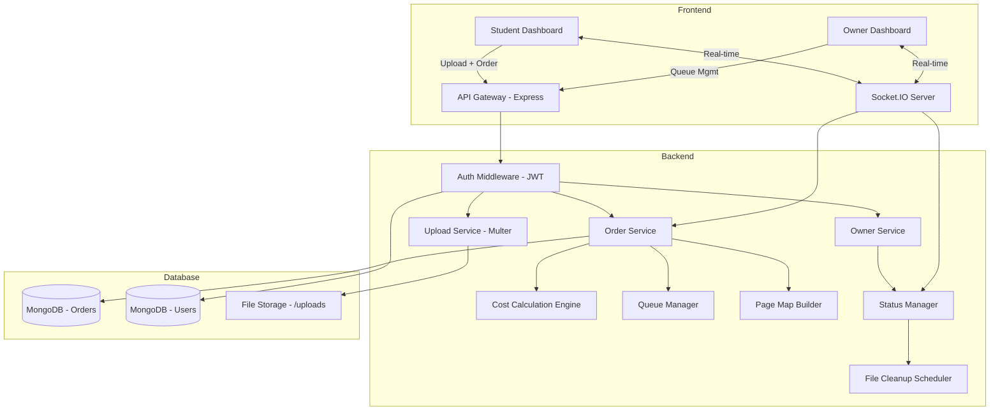
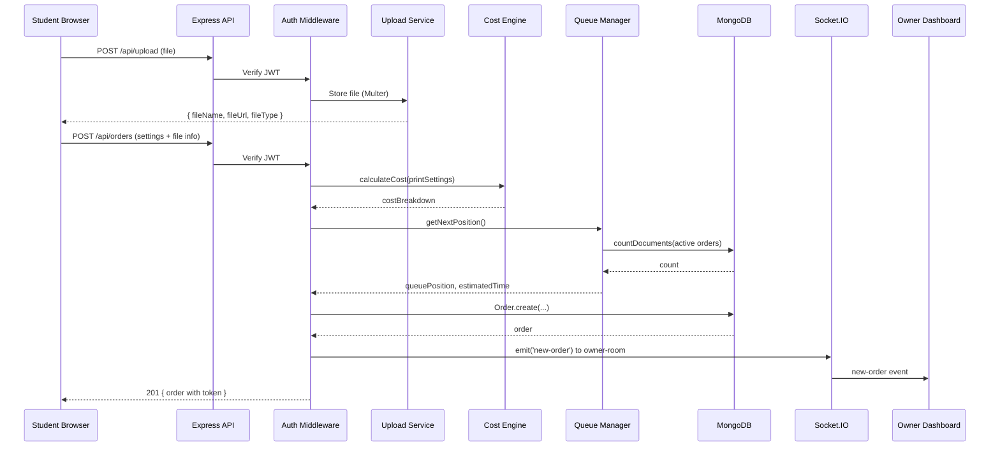
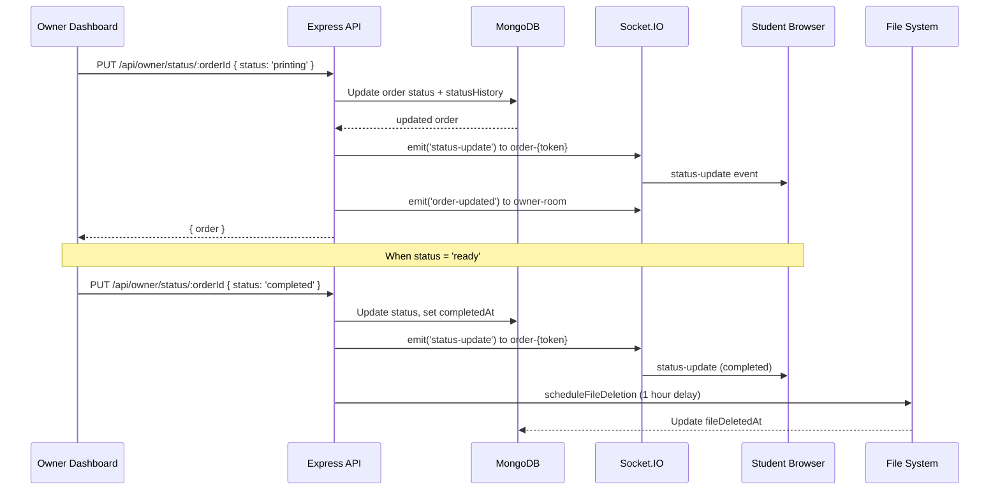

# Design Document: Smart Xerox Queue Management System

## Overview

The Smart Xerox Queue Management System is a full-stack web application that digitizes the print shop workflow. Students upload documents, configure per-page-range printing preferences (color/B&W, single/double-sided, binding), and submit print orders. The system calculates costs automatically, assigns a FIFO queue position with a unique token, and provides real-time status tracking via Socket.IO. The shop owner receives orders on a dedicated dashboard, manages the print queue, updates statuses, and triggers file auto-deletion upon completion.

This design extends the existing Express.js/MongoDB/Socket.IO backend by enhancing the order creation flow with a page-range-aware cost engine, adding a page map conflict detection system, implementing scheduled file cleanup with configurable retention, and enriching the real-time notification layer for granular status transitions.

## Architecture



## Sequence Diagrams

### Order Submission Flow



### Status Update Flow



## Components and Interfaces

### Component 1: Cost Calculation Engine

**Purpose**: Computes total printing cost based on per-page-range settings, copies, binding, and surcharges.

**Interface**:
```javascript
// controllers/costController.js (enhanced)
const PRICES = {
  bw: 2,           // ₹ per page
  color: 10,       // ₹ per page
  doubleSide: 1.5, // ₹ surcharge per double-sided page
  binding: { none: 0, spiral: 30, stapling: 5, lamination: 20 },
  urgent: 20       // flat surcharge
};

/**
 * @param {PrintSettings} settings
 * @returns {CostBreakdown}
 */
function calculateCost(settings) { /* ... */ }

/**
 * @param {PageRange[]} ranges
 * @param {number} totalPages
 * @returns {PageMapEntry[]}
 */
function buildPageMap(ranges, totalPages) { /* ... */ }

/**
 * @param {PageRange[]} ranges
 * @param {number} totalPages
 * @returns {Conflict[]}
 */
function detectConflicts(ranges, totalPages) { /* ... */ }
```

**Responsibilities**:
- Calculate per-range costs (color pages × rate + B&W pages × rate)
- Apply double-side surcharge per applicable page
- Add binding and urgent surcharges
- Build page map array for frontend visualization
- Detect overlapping page ranges and report conflicts

### Component 2: Queue Manager

**Purpose**: Manages FIFO ordering of print jobs, assigns queue positions, and recalculates positions on status changes.

**Interface**:
```javascript
// services/queueManager.js
/**
 * @param {string} orderId - New order to enqueue
 * @returns {{ queuePosition: number, estimatedTime: number }}
 */
async function enqueue(orderId) { /* ... */ }

/**
 * Recalculates positions for all active orders after a status change
 * @returns {void}
 */
async function recalculatePositions() { /* ... */ }

/**
 * @returns {{ activeCount: number, estimatedWait: number }}
 */
async function getQueueStatus() { /* ... */ }
```

**Responsibilities**:
- Assign sequential queue positions on order creation
- Recalculate positions when orders complete or cancel
- Estimate wait time based on average processing time per page
- Emit queue position updates via Socket.IO

### Component 3: Page Map Builder

**Purpose**: Constructs a per-page visualization array showing color type, print side, and conflict status for each page in the document.

**Interface**:
```javascript
// services/pageMapBuilder.js
/**
 * @param {PageRange[]} ranges
 * @param {number} totalPages
 * @returns {PageMapEntry[]} Array of length totalPages
 */
function buildPageMap(ranges, totalPages) { /* ... */ }

/**
 * @typedef {Object} PageMapEntry
 * @property {number} page - 1-indexed page number
 * @property {'color'|'bw'|'default'} colorType
 * @property {'single'|'double'|'default'} side
 * @property {boolean} hasConflict - true if multiple ranges cover this page
 * @property {string} label - 'C', 'B', '?', or '!'
 */
```

**Responsibilities**:
- Map each page to its assigned range settings
- Mark unassigned pages with default settings (B&W, single-side)
- Detect and flag pages covered by multiple overlapping ranges
- Generate labels for frontend grid visualization

### Component 4: File Cleanup Scheduler

**Purpose**: Automatically deletes uploaded files after order completion or after a configurable retention period.

**Interface**:
```javascript
// services/fileCleanup.js
/**
 * Schedule file deletion after order completion
 * @param {Order} order
 * @param {number} delayMs - Default 3600000 (1 hour)
 */
function scheduleFileDeletion(order, delayMs = 3600000) { /* ... */ }

/**
 * Cleanup orphaned files older than retention period
 * Runs on server startup and periodically
 */
async function cleanupOrphanedFiles() { /* ... */ }

/**
 * @param {string} filePath
 * @returns {Promise<boolean>} success
 */
async function deleteFile(filePath) { /* ... */ }
```

**Responsibilities**:
- Delete files 1 hour after order completion
- Run periodic cleanup for orphaned files (files without matching active orders)
- Update order record with `fileDeletedAt` timestamp
- Handle missing files gracefully (already deleted)

### Component 5: Real-Time Notification Service

**Purpose**: Manages Socket.IO event emission for order lifecycle events.

**Interface**:
```javascript
// services/notificationService.js
/**
 * Notify owner room of new order
 * @param {Server} io - Socket.IO server instance
 * @param {Order} order
 */
function notifyNewOrder(io, order) { /* ... */ }

/**
 * Notify student of status change
 * @param {Server} io
 * @param {Order} order
 * @param {string} newStatus
 */
function notifyStatusChange(io, order, newStatus) { /* ... */ }

/**
 * Notify all students of queue position updates
 * @param {Server} io
 * @param {Array<{token, position, estimatedTime}>} updates
 */
function notifyQueueUpdate(io, updates) { /* ... */ }
```

**Responsibilities**:
- Emit `new-order` to owner-room on order creation
- Emit `status-update` to order-specific room on status change
- Emit `queue-update` to affected students when positions shift
- Emit `order-ready` notification when status becomes 'ready'

## Data Models

### Model: Order (Enhanced)

```javascript
// models/Order.js - Enhanced schema
const pageRangeSchema = {
  from: { type: Number, required: true, min: 1 },
  to: { type: Number, required: true, min: 1 },
  colorType: { type: String, enum: ['color', 'bw'], default: 'bw' },
  side: { type: String, enum: ['single', 'double'], default: 'single' }
};

const printSettingsSchema = {
  mode: { type: String, enum: ['whole', 'page-range'], default: 'whole' },
  colorType: { type: String, enum: ['color', 'bw'], default: 'bw' },
  side: { type: String, enum: ['single', 'double'], default: 'single' },
  copies: { type: Number, default: 1, min: 1, max: 100 },
  totalPages: { type: Number, required: true, min: 1 },
  paperSize: { type: String, enum: ['A4', 'A3', 'Legal'], default: 'A4' },
  orientation: { type: String, enum: ['portrait', 'landscape'], default: 'portrait' },
  binding: { type: String, enum: ['none', 'spiral', 'stapling', 'lamination'], default: 'none' },
  priority: { type: String, enum: ['normal', 'urgent'], default: 'normal' },
  pageRanges: [pageRangeSchema]
};

const costBreakdownSchema = {
  colorPages: { type: Number, default: 0 },
  bwPages: { type: Number, default: 0 },
  colorPagesCost: { type: Number, default: 0 },
  bwPagesCost: { type: Number, default: 0 },
  doubleSideCost: { type: Number, default: 0 },
  bindingCost: { type: Number, default: 0 },
  urgentSurcharge: { type: Number, default: 0 },
  total: { type: Number, required: true }
};

const orderSchema = {
  token: { type: String, unique: true },  // e.g., 'PX742'
  student: { type: ObjectId, ref: 'User', required: true },
  studentName: { type: String, required: true },
  studentUSN: { type: String },
  fileName: { type: String, required: true },
  originalName: { type: String, required: true },
  fileUrl: { type: String, required: true },
  fileType: { type: String },
  printSettings: printSettingsSchema,
  cost: costBreakdownSchema,
  paymentMethod: { type: String, enum: ['upi', 'phonePe', 'googlePay', 'razorpay', 'paytm', 'counter'], default: 'counter' },
  paymentStatus: { type: String, enum: ['paid', 'unpaid', 'pending'], default: 'unpaid' },
  status: { type: String, enum: ['waiting', 'processing', 'printing', 'ready', 'completed', 'cancelled'], default: 'waiting' },
  queuePosition: { type: Number },
  estimatedTime: { type: Number, default: 10 },  // minutes
  statusHistory: [{ status: String, timestamp: Date, note: String }],
  smartHeader: { type: String },
  fileDeletedAt: { type: Date },
  completedAt: { type: Date },
  createdAt: { type: Date, default: Date.now }
};
```

**Validation Rules**:
- `pageRanges[].from` must be ≥ 1 and ≤ `totalPages`
- `pageRanges[].to` must be ≥ `from` and ≤ `totalPages`
- `copies` must be between 1 and 100
- `totalPages` must be ≥ 1
- `token` is auto-generated as 'PX' + 3 random digits
- Status transitions must follow: waiting → processing → printing → ready → completed

### Model: User (Existing - No Changes)

```javascript
const userSchema = {
  name: { type: String, required: true },
  usn: { type: String, uppercase: true },
  email: { type: String, required: true, unique: true },
  phone: { type: String },
  password: { type: String },
  role: { type: String, enum: ['student', 'owner', 'admin'], default: 'student' },
  college: { type: String },
  createdAt: { type: Date, default: Date.now }
};
```

## Algorithmic Pseudocode

### Cost Calculation Algorithm

```javascript
/**
 * ALGORITHM: calculateCost
 * INPUT: settings { mode, colorType, side, copies, totalPages, binding, priority, pageRanges }
 * OUTPUT: CostBreakdown { colorPages, bwPages, colorPagesCost, bwPagesCost, doubleSideCost, bindingCost, urgentSurcharge, total }
 *
 * PRECONDITIONS:
 *   - settings.totalPages >= 1
 *   - settings.copies >= 1
 *   - If mode === 'page-range', pageRanges is a non-empty array
 *   - Each range: 1 <= from <= to <= totalPages
 *
 * POSTCONDITIONS:
 *   - total === colorPagesCost + bwPagesCost + doubleSideCost + bindingCost + urgentSurcharge
 *   - colorPages + bwPages === totalPages (all pages accounted for)
 *   - All cost values >= 0
 */
function calculateCost(settings) {
  const { mode, colorType, side, copies, totalPages, binding, priority, pageRanges } = settings;
  let colorPages = 0, bwPages = 0, doublePages = 0;

  if (mode === 'whole') {
    // Whole document mode: uniform settings
    if (colorType === 'color') colorPages = totalPages;
    else bwPages = totalPages;
    if (side === 'double') doublePages = totalPages;
  } else {
    // Page-range mode: build page map, resolve per-page settings
    const pageMap = new Array(totalPages + 1).fill(null); // 1-indexed

    // LOOP INVARIANT: pageMap[p] contains the FIRST range that covers page p
    for (const range of (pageRanges || [])) {
      for (let p = range.from; p <= Math.min(range.to, totalPages); p++) {
        if (pageMap[p] === null) {
          pageMap[p] = range; // first-write wins (no overwrite)
        }
      }
    }

    // LOOP INVARIANT: colorPages + bwPages === number of pages processed so far
    for (let p = 1; p <= totalPages; p++) {
      const entry = pageMap[p];
      if (!entry || entry.colorType === 'bw') bwPages++;
      else colorPages++;
      if (entry && entry.side === 'double') doublePages++;
    }
  }

  const colorPagesCost = colorPages * copies * PRICES.color;
  const bwPagesCost = bwPages * copies * PRICES.bw;
  const doubleSideCost = Math.round(doublePages * copies * PRICES.doubleSide);
  const bindingCost = PRICES.binding[binding] || 0;
  const urgentSurcharge = priority === 'urgent' ? PRICES.urgent : 0;
  const total = colorPagesCost + bwPagesCost + doubleSideCost + bindingCost + urgentSurcharge;

  return { colorPages, bwPages, colorPagesCost, bwPagesCost, doubleSideCost, bindingCost, urgentSurcharge, total };
}
```

### Page Map Builder Algorithm

```javascript
/**
 * ALGORITHM: buildPageMap
 * INPUT: ranges (PageRange[]), totalPages (number)
 * OUTPUT: PageMapEntry[] of length totalPages
 *
 * PRECONDITIONS:
 *   - totalPages >= 1
 *   - Each range: 1 <= from <= to <= totalPages
 *
 * POSTCONDITIONS:
 *   - Result array has exactly totalPages entries
 *   - Each entry has page number (1-indexed), colorType, side, hasConflict, label
 *   - hasConflict === true iff page is covered by 2+ ranges
 *   - Unassigned pages have colorType='default', side='default', label='?'
 *
 * LOOP INVARIANT:
 *   - coverCount[p] === number of ranges that include page p
 */
function buildPageMap(ranges, totalPages) {
  const coverCount = new Array(totalPages + 1).fill(0);
  const firstRange = new Array(totalPages + 1).fill(null);

  // Pass 1: Count coverage and record first range per page
  for (const range of ranges) {
    for (let p = range.from; p <= Math.min(range.to, totalPages); p++) {
      coverCount[p]++;
      if (firstRange[p] === null) firstRange[p] = range;
    }
  }

  // Pass 2: Build page map entries
  const pageMap = [];
  for (let p = 1; p <= totalPages; p++) {
    const hasConflict = coverCount[p] > 1;
    const range = firstRange[p];

    if (hasConflict) {
      pageMap.push({ page: p, colorType: range.colorType, side: range.side, hasConflict: true, label: '!' });
    } else if (range) {
      const label = range.colorType === 'color' ? 'C' : 'B';
      pageMap.push({ page: p, colorType: range.colorType, side: range.side, hasConflict: false, label });
    } else {
      pageMap.push({ page: p, colorType: 'default', side: 'default', hasConflict: false, label: '?' });
    }
  }

  return pageMap;
}
```

### Queue Management Algorithm

```javascript
/**
 * ALGORITHM: enqueue
 * INPUT: orderId (string)
 * OUTPUT: { queuePosition, estimatedTime }
 *
 * PRECONDITIONS:
 *   - orderId references a valid order in 'waiting' status
 *   - Order has printSettings.totalPages defined
 *
 * POSTCONDITIONS:
 *   - order.queuePosition === (count of active orders before this one) + 1
 *   - order.estimatedTime === queuePosition * AVG_MINUTES_PER_ORDER
 *   - Order is persisted with updated position
 */
async function enqueue(orderId) {
  const AVG_MINUTES_PER_ORDER = 5;
  const activeCount = await Order.countDocuments({
    status: { $in: ['waiting', 'processing', 'printing'] },
    _id: { $ne: orderId }
  });

  const queuePosition = activeCount + 1;
  const estimatedTime = queuePosition * AVG_MINUTES_PER_ORDER;

  await Order.findByIdAndUpdate(orderId, { queuePosition, estimatedTime });
  return { queuePosition, estimatedTime };
}

/**
 * ALGORITHM: recalculatePositions
 * INPUT: none (operates on database state)
 * OUTPUT: void (side effect: updates all active orders)
 *
 * PRECONDITIONS:
 *   - Called after a status change (completion or cancellation)
 *
 * POSTCONDITIONS:
 *   - All active orders have sequential positions starting from 1
 *   - Position order matches createdAt ascending (FIFO)
 *   - estimatedTime = position * AVG_MINUTES_PER_ORDER for each order
 *
 * LOOP INVARIANT:
 *   - After processing i orders, positions 1..i are correctly assigned
 */
async function recalculatePositions() {
  const AVG_MINUTES_PER_ORDER = 5;
  const activeOrders = await Order.find({
    status: { $in: ['waiting', 'processing', 'printing'] }
  }).sort({ createdAt: 1 });

  const bulkOps = activeOrders.map((order, index) => ({
    updateOne: {
      filter: { _id: order._id },
      update: { queuePosition: index + 1, estimatedTime: (index + 1) * AVG_MINUTES_PER_ORDER }
    }
  }));

  if (bulkOps.length > 0) {
    await Order.bulkWrite(bulkOps);
  }

  return activeOrders.map((order, index) => ({
    token: order.token,
    position: index + 1,
    estimatedTime: (index + 1) * AVG_MINUTES_PER_ORDER
  }));
}
```

### Status Transition Algorithm

```javascript
/**
 * ALGORITHM: updateOrderStatus
 * INPUT: orderId (string), newStatus (string), note (string)
 * OUTPUT: updated Order
 *
 * PRECONDITIONS:
 *   - orderId references a valid order
 *   - newStatus is a valid status enum value
 *   - Transition is valid per state machine:
 *     waiting → processing → printing → ready → completed
 *     Any active state → cancelled
 *
 * POSTCONDITIONS:
 *   - order.status === newStatus
 *   - order.statusHistory contains new entry with timestamp
 *   - If newStatus === 'completed': order.completedAt is set, file deletion scheduled
 *   - Socket.IO events emitted to relevant rooms
 *   - Queue positions recalculated if order left active queue
 */
const VALID_TRANSITIONS = {
  waiting: ['processing', 'cancelled'],
  processing: ['printing', 'cancelled'],
  printing: ['ready', 'cancelled'],
  ready: ['completed', 'cancelled'],
  completed: [],
  cancelled: []
};

async function updateOrderStatus(orderId, newStatus, note, io) {
  const order = await Order.findById(orderId);
  if (!order) throw new Error('Order not found');

  const allowed = VALID_TRANSITIONS[order.status];
  if (!allowed.includes(newStatus)) {
    throw new Error(`Cannot transition from '${order.status}' to '${newStatus}'`);
  }

  order.status = newStatus;
  order.statusHistory.push({ status: newStatus, timestamp: new Date(), note: note || '' });

  if (newStatus === 'completed') {
    order.completedAt = new Date();
    scheduleFileDeletion(order);
  }

  await order.save();

  // Recalculate queue if order left active states
  if (['completed', 'cancelled'].includes(newStatus)) {
    const updates = await recalculatePositions();
    notifyQueueUpdate(io, updates);
  }

  notifyStatusChange(io, order, newStatus);
  return order;
}
```

## Key Functions with Formal Specifications

### Function: calculateCost()

```javascript
function calculateCost(settings) // → CostBreakdown
```

**Preconditions:**
- `settings` is non-null object
- `settings.totalPages` is a positive integer ≥ 1
- `settings.copies` is a positive integer ≥ 1
- If `settings.mode === 'page-range'`, then `settings.pageRanges` is a non-empty array
- Each range in `pageRanges`: `1 ≤ from ≤ to ≤ totalPages`

**Postconditions:**
- Returns object with all numeric cost fields ≥ 0
- `result.total === result.colorPagesCost + result.bwPagesCost + result.doubleSideCost + result.bindingCost + result.urgentSurcharge`
- `result.colorPages + result.bwPages === settings.totalPages`
- No side effects on input

**Loop Invariants:**
- Page map construction: `pageMap[p]` is either null or the first range covering page p
- Cost accumulation: running sum of colorPages + bwPages equals pages processed

### Function: buildPageMap()

```javascript
function buildPageMap(ranges, totalPages) // → PageMapEntry[]
```

**Preconditions:**
- `totalPages` ≥ 1
- `ranges` is an array (may be empty)
- Each range: `1 ≤ from ≤ to ≤ totalPages`

**Postconditions:**
- Returns array of exactly `totalPages` entries
- Each entry has `page` (1-indexed), `colorType`, `side`, `hasConflict`, `label`
- `hasConflict === true` iff `coverCount[page] > 1`
- Labels: 'C' for color, 'B' for B&W, '?' for unassigned, '!' for conflict

**Loop Invariants:**
- After processing range r: `coverCount[p]` equals number of ranges 0..r that include page p

### Function: detectConflicts()

```javascript
function detectConflicts(ranges, totalPages) // → Conflict[]
```

**Preconditions:**
- `totalPages` ≥ 1
- `ranges` is an array

**Postconditions:**
- Returns array of conflict objects `{ page, ranges: [rangeIndex1, rangeIndex2, ...] }`
- Only pages with 2+ covering ranges appear in result
- Result is sorted by page number ascending

### Function: enqueue()

```javascript
async function enqueue(orderId) // → { queuePosition, estimatedTime }
```

**Preconditions:**
- `orderId` references a valid Order document
- Order status is 'waiting'

**Postconditions:**
- `queuePosition` is a positive integer
- `estimatedTime` = `queuePosition * 5` (minutes)
- Order document updated in database

### Function: updateOrderStatus()

```javascript
async function updateOrderStatus(orderId, newStatus, note, io) // → Order
```

**Preconditions:**
- `orderId` references a valid Order document
- `newStatus` is in VALID_TRANSITIONS[currentStatus]
- `io` is a valid Socket.IO server instance

**Postconditions:**
- `order.status === newStatus`
- `order.statusHistory` has new entry with current timestamp
- If completed: `order.completedAt` is set, file deletion scheduled
- Socket.IO events emitted
- If order left active queue: all remaining positions recalculated

## Example Usage

```javascript
// Example 1: Create order with page ranges
const printSettings = {
  mode: 'page-range',
  copies: 2,
  totalPages: 20,
  paperSize: 'A4',
  orientation: 'portrait',
  binding: 'spiral',
  priority: 'normal',
  pageRanges: [
    { from: 1, to: 5, colorType: 'color', side: 'single' },
    { from: 6, to: 15, colorType: 'bw', side: 'double' },
    { from: 16, to: 20, colorType: 'color', side: 'single' }
  ]
};

const cost = calculateCost(printSettings);
// → { colorPages: 10, bwPages: 10, colorPagesCost: 200, bwPagesCost: 40,
//    doubleSideCost: 30, bindingCost: 30, urgentSurcharge: 0, total: 300 }

// Example 2: Build page map for visualization
const pageMap = buildPageMap(printSettings.pageRanges, 20);
// → [{ page: 1, colorType: 'color', side: 'single', hasConflict: false, label: 'C' },
//    { page: 6, colorType: 'bw', side: 'double', hasConflict: false, label: 'B' },
//    ...]

// Example 3: Detect conflicts with overlapping ranges
const conflictRanges = [
  { from: 1, to: 10, colorType: 'color', side: 'single' },
  { from: 8, to: 15, colorType: 'bw', side: 'double' }
];
const conflicts = detectConflicts(conflictRanges, 15);
// → [{ page: 8, ranges: [0, 1] }, { page: 9, ranges: [0, 1] }, { page: 10, ranges: [0, 1] }]

// Example 4: Status transition with Socket.IO notification
const io = req.app.get('io');
const updatedOrder = await updateOrderStatus(orderId, 'printing', 'Started printing', io);
// → Emits 'status-update' to student, 'order-updated' to owner room

// Example 5: Queue recalculation after completion
await updateOrderStatus(orderId, 'completed', 'Collected by student', io);
// → Recalculates positions for all remaining active orders
// → Emits 'queue-update' to all affected students

// Example 6: File upload and order creation flow
const uploadResponse = await fetch('/api/upload', {
  method: 'POST',
  headers: { 'Authorization': `Bearer ${token}` },
  body: formData  // FormData with 'document' field
});
const { fileName, originalName, fileUrl, fileType } = await uploadResponse.json();

const orderResponse = await fetch('/api/orders', {
  method: 'POST',
  headers: { 'Authorization': `Bearer ${token}`, 'Content-Type': 'application/json' },
  body: JSON.stringify({ fileName, originalName, fileUrl, fileType, printSettings })
});
const order = await orderResponse.json();
// → order.token = 'PX742', order.queuePosition = 3, order.estimatedTime = 15
```

## Correctness Properties

*A property is a characteristic or behavior that should hold true across all valid executions of a system — essentially, a formal statement about what the system should do. Properties serve as the bridge between human-readable specifications and machine-verifiable correctness guarantees.*

### Property 1: Cost total is always the sum of its components

*For any* valid print settings (in either 'whole' or 'page-range' mode), the total cost must equal the sum of colorPagesCost, bwPagesCost, doubleSideCost, bindingCost, and urgentSurcharge.

**Validates: Requirements 3.1, 3.7**

### Property 2: All pages are accounted for in cost calculation

*For any* valid print settings, the number of color pages plus B&W pages must equal the totalPages value, ensuring every page is classified exactly once.

**Validates: Requirements 3.8**

### Property 3: Cost is always non-negative

*For any* valid print settings, all individual cost fields (colorPagesCost, bwPagesCost, doubleSideCost, bindingCost, urgentSurcharge) and the total must be greater than or equal to zero.

**Validates: Requirements 3.9**

### Property 4: Double-side cost only applies to double-sided pages

*For any* print settings where no page is configured as double-sided, the doubleSideCost must be zero. Conversely, when double-sided pages exist, the doubleSideCost must equal the count of double-sided pages multiplied by copies multiplied by the surcharge rate.

**Validates: Requirements 3.4**

### Property 5: Page map has exactly totalPages entries

*For any* set of page ranges and a total page count, the built page map must contain exactly totalPages entries, each with a 1-indexed page number.

**Validates: Requirements 4.1**

### Property 6: Page map labeling is consistent with coverage

*For any* set of page ranges and total page count: pages covered by exactly one range get label 'C' (color) or 'B' (B&W) matching the range's colorType; pages not covered by any range get colorType 'default', side 'default', and label '?'; pages covered by two or more ranges get hasConflict true and label '!'.

**Validates: Requirements 4.2, 4.3, 4.4**

### Property 7: Conflict detection is consistent with page map

*For any* set of page ranges and total page count, a page has hasConflict true in the page map if and only if that page appears in the detectConflicts result, and the conflict result includes all range indices covering that page.

**Validates: Requirements 5.1, 5.2**

### Property 8: Conflicts are sorted by page number

*For any* set of page ranges, the detectConflicts result is sorted by page number in ascending order.

**Validates: Requirements 5.3**

### Property 9: Non-overlapping ranges produce no conflicts

*For any* set of page ranges where no two ranges share a common page, the detectConflicts result must be an empty array.

**Validates: Requirements 5.4**

### Property 10: Queue positions are sequential starting from 1

*For any* set of active orders (status in waiting, processing, printing) after any enqueue or recalculation operation, their queue positions must form a contiguous sequence [1, 2, ..., n] ordered by creation time (FIFO).

**Validates: Requirements 7.1, 7.3, 7.4**

### Property 11: Estimated wait time equals position times 5 minutes

*For any* active order, its estimated wait time must equal its queue position multiplied by 5 minutes.

**Validates: Requirements 7.2**

### Property 12: Status transitions follow valid state machine

*For any* order and any attempted status transition, the transition succeeds if and only if the new status is in the valid transitions set for the current status. Valid forward transitions are: waiting→processing→printing→ready→completed. Any active state may transition to cancelled. Completed and cancelled are terminal states with no valid outgoing transitions.

**Validates: Requirements 8.1, 8.2, 8.3, 8.6**

### Property 13: Status history grows monotonically with transitions

*For any* order, after each successful status transition, the statusHistory array length increases by exactly one, and the new entry contains the new status and a timestamp not earlier than the previous entry's timestamp.

**Validates: Requirements 8.4**

### Property 14: Completed orders always have completedAt set

*For any* order with status 'completed', the completedAt timestamp must not be null and must be a valid date.

**Validates: Requirements 8.5**

### Property 15: Token format is always valid

*For any* generated order token, it must match the pattern 'PX' followed by exactly 3 digits (regex: /^PX\d{3}$/).

**Validates: Requirements 6.2**

### Property 16: Invalid page ranges are always rejected

*For any* page range where from > to, or from < 1, or to > totalPages, the system must reject the input with a validation error.

**Validates: Requirements 6.4, 12.1, 12.2**

### Property 17: First-write-wins resolution for overlapping ranges

*For any* set of overlapping page ranges, the cost calculation and page map must use the settings from the first range (by array order) that covers each page.

**Validates: Requirements 3.2, 4.5**

## Error Handling

### Error Scenario 1: Invalid Page Ranges

**Condition**: User submits page ranges where `from > to` or `to > totalPages`
**Response**: Return 400 with descriptive error message identifying the invalid range
**Recovery**: Frontend highlights the invalid range in the page map preview; user corrects and resubmits

### Error Scenario 2: File Upload Failure

**Condition**: File exceeds 50MB limit, unsupported format, or disk write fails
**Response**: Multer returns appropriate error; API returns 400 with `message` field
**Recovery**: Frontend shows error toast; user can retry with a valid file

### Error Scenario 3: Invalid Status Transition

**Condition**: Owner attempts to transition order to an invalid state (e.g., 'waiting' → 'completed')
**Response**: Return 400 with message explaining valid transitions from current state
**Recovery**: Owner dashboard only shows valid next-status buttons based on current state

### Error Scenario 4: Concurrent Status Updates

**Condition**: Two owners attempt to update the same order simultaneously
**Response**: Use Mongoose versioning (`__v`) to detect conflicts; second update gets 409 Conflict
**Recovery**: Dashboard refreshes order state and retries with current version

### Error Scenario 5: File Already Deleted

**Condition**: Owner tries to access file URL after auto-deletion
**Response**: Return 404 for file; order record shows `fileDeletedAt` timestamp
**Recovery**: Order remains in history with metadata; file is simply unavailable

### Error Scenario 6: Socket.IO Disconnection

**Condition**: Student or owner loses WebSocket connection
**Response**: Socket.IO auto-reconnects; client re-joins rooms on reconnect
**Recovery**: On reconnect, client fetches current state via REST API to sync missed events

## Testing Strategy

### Unit Testing Approach

**Target**: Cost calculation engine, page map builder, conflict detection, queue manager

Key test cases:
- `calculateCost` with whole-document mode (color, B&W, single, double)
- `calculateCost` with multiple page ranges covering all pages
- `calculateCost` with partial page ranges (some pages unassigned)
- `buildPageMap` with no ranges (all default)
- `buildPageMap` with overlapping ranges (conflict detection)
- `buildPageMap` with adjacent non-overlapping ranges
- `detectConflicts` with no overlaps → empty result
- `detectConflicts` with multiple overlapping ranges
- Status transition validation (valid and invalid transitions)
- Queue position calculation and recalculation

### Property-Based Testing Approach

**Property Test Library**: fast-check

Properties to test:
1. Cost total decomposition (sum of parts equals total)
2. Page coverage completeness (all pages accounted for)
3. Page map length invariant (always equals totalPages)
4. Conflict consistency (page map conflicts match detectConflicts output)
5. Queue position sequentiality (always 1..n with no gaps)
6. Cost non-negativity (all cost fields ≥ 0)
7. Idempotent cost calculation (same input → same output)

### Integration Testing Approach

- Full order creation flow: upload → calculate cost → create order → verify queue position
- Status update flow: update status → verify Socket.IO emission → verify queue recalculation
- File cleanup: complete order → wait → verify file deleted and `fileDeletedAt` set
- Concurrent order creation: multiple students submitting simultaneously → verify unique tokens and correct positions

## Performance Considerations

- **Page Map Construction**: O(R × P) where R = number of ranges, P = pages per range. For typical documents (< 500 pages, < 10 ranges), this is negligible.
- **Queue Recalculation**: Uses MongoDB `bulkWrite` to update all active orders in a single database round-trip. Active queue is expected to be < 50 orders at any time.
- **File Cleanup**: Uses `setTimeout` for individual orders. On server restart, `cleanupOrphanedFiles()` scans for files older than retention period. Consider using a job queue (e.g., Bull/Agenda) if order volume exceeds 1000/day.
- **Socket.IO Rooms**: Each student joins their order-specific room (`order-{token}`). Owner joins `owner-room`. This limits broadcast scope and prevents unnecessary event delivery.
- **Cost Calculation API**: Stateless and synchronous — can be called on every form change for live preview without database queries.
- **Database Indexes**: Ensure compound index on `{ status: 1, createdAt: 1 }` for efficient queue queries.

## Security Considerations

- **Authentication**: All API endpoints (except health check) require valid JWT via `protect` middleware.
- **Authorization**: Owner endpoints use `ownerOnly` middleware; students cannot access queue management.
- **File Access**: Upload directory served as static files — consider adding token-based file access to prevent URL guessing.
- **File Deletion**: Auto-deletion after 1 hour protects student document privacy. Orphan cleanup handles edge cases.
- **Input Validation**: Page ranges validated server-side (from ≤ to ≤ totalPages, copies within bounds).
- **Rate Limiting**: Consider adding rate limiting to upload and order creation endpoints to prevent abuse.
- **Token Uniqueness**: Order tokens ('PX' + 3 digits) have collision risk at scale. For production, use longer tokens or UUID-based approach.

## Dependencies

| Dependency | Version | Purpose |
|-----------|---------|---------|
| express | ^4.18.2 | HTTP server and routing |
| mongoose | ^7.0.0 | MongoDB ODM |
| socket.io | ^4.6.0 | Real-time WebSocket communication |
| jsonwebtoken | ^9.0.0 | JWT authentication |
| bcryptjs | ^2.4.3 | Password hashing |
| multer | ^1.4.5-lts.1 | File upload handling |
| uuid | ^9.0.0 | Unique ID generation |
| cors | ^2.8.5 | Cross-origin resource sharing |
| dotenv | ^16.0.3 | Environment variable management |
| node-cron (new) | ^3.0.0 | Scheduled file cleanup jobs |
| fast-check (dev) | ^3.15.0 | Property-based testing |
| jest (dev) | ^29.0.0 | Test runner |
